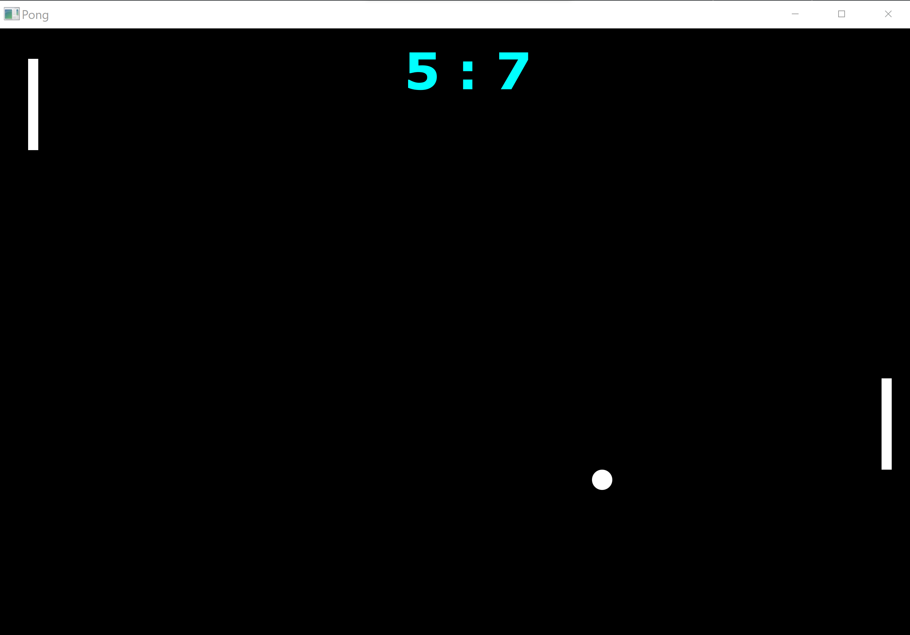

# pong
<h2>Online multiplayer pong game (using sockets)</h2>

<h2>The project has two main components:</h2>
<h3>Window.java: The "game console"- previews the game window</h3>
<h3>Player.java: The "player controller"- controls the players with the UP/DOWN arrows.</h3

 
 

<h2>How to play:</h2>
<h3>run Window.java.</h3>
<h3>run Player.java on two computers.</h3>
<h3>start playing using the UP/DOWN arrows.</h3>
<h3>Have fun!</h3>

 

